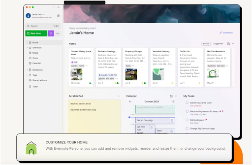
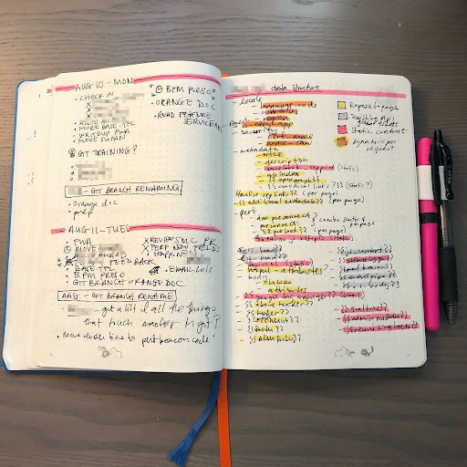

# Team 21 Starting Pitch:

## Statement of Purpose:
As aspiring Software Engineers ourselves, we understand the necessity and benefit of a tool that can help us manage our project tasks to enhance our productivity. This is why our team is combining the needs and wants from our past experiences and proposing to create a comprehensive Developer Journal that can help Software Engineers throughout their career, from assisting with tracking progress during sprints throughout the Software Development Life Cycle (SDLC) to a casual digital canvas where engineers can jot down their creative ideas that help them learn new technology.

Additionally, we believe that the Developer Journal we propose to create will significantly aid Software Engineers with crucial non-technical aspects of their career. We will ensure that the integrated tasklist and calendar features will not only be designed in a way for engineers to develop their technical prowess, but keep in mind ways for them to reflect on their goals set, engage with time management, and actively practice documentation and feedback to enhance their communication skills to reinforce the critical soft skills in Software Engineering.

Therefore, by providing a centralized platform for journaling, task management, and scheduling, we look to support developers in key technical and non-technical ways to achieve greater efficiency and productivity throughout their career.

## Plan of Action:
We plan to implement the following features into our Developer Journal. We will tackle each milestone based on its priority. 

### Primary Features (Must complete core features):
- Journaling Capability: The core functionality of the Developer Journal will be its journaling feature, allowing developers to document their daily activities, insights, challenges, and solutions. This will enable users to reflect on their progress, identify patterns, and maintain a comprehensive log of their work over time.
- Statistics: This will allow the developer to analyze their effectiveness on a daily, monthly, or yearly basis. 

### Secondary Features (May or may not complete all features): 
- Tasklist Management: Integration of a robust tasklist system will empower developers to create, prioritize, and manage their tasks seamlessly within the same platform. Users can categorize tasks, set deadlines, assign priorities, and track completion status, thereby enhancing productivity and ensuring timely project delivery.
- Calendar Integration: The inclusion of a calendar feature will enable developers to schedule meetings, set reminders, and plan their workdays effectively.
- Customization Options: Recognizing that different developers have unique preferences and workflows, the Developer Journal will offer several customization options. Users will have the flexibility to personalize their journal layout, tasklist categories, calendar views, and notification settings. 

### Extra time (Unlikely to reach this point): 
Integration with popular calendar applications such as Google Calendar and Outlook will ensure synchronization across devices and seamless access to important events and deadlines.

## User Personas:
- Student coder:
  - The Student Coder is someone who has worked on a few projects and is starting new ones in classes and clubs. They’d like an easy to use journal where they can keep track of the things they’ve learned through working on their projects.
- SWE:
  - The SWE is someone who is (as the name suggests) a software engineer. They’d like an organized journal where they can summarize the problems they’ve faced and their solutions, so they can refer back to them in the future.
- Beginner coder:
  - The Beginner Coder is someone who’s about to embark on their first project. They’re a little worried and like to be organized, and after hearing that keeping a journal is useful, they’d like to try it out. They’ll probably just use the journal in the manner that its features suggest.
- Senior developer:
  - The Senior Developer has already been journaling using custom markdown files for several years. However, they’re finding it to be tedious and a little unwieldy. They would like to be able to migrate their existing journal to an application, and continue using said application onwards.

## Risks and Rabbit Holes:
One of the potential problems with labeling each task a custom label is that we might end up creating too many labels, making it difficult to navigate when adding labels → potential solution: create a group category for labels
Additionally, it may difficult to ascertain what layouts and visual appearances users find convenient to use
Another rabbit hole would be to copy an existing websites purpose, as our website should have certain unique strengths not offered by other websites

## Visualizations:
Upon logging in, users will see the journal in the center of the page, along with a sidebar allowing them to toggle between the secondary features of tasklist, calendar, and settings (where customizations are located). 

Inspiration: 

